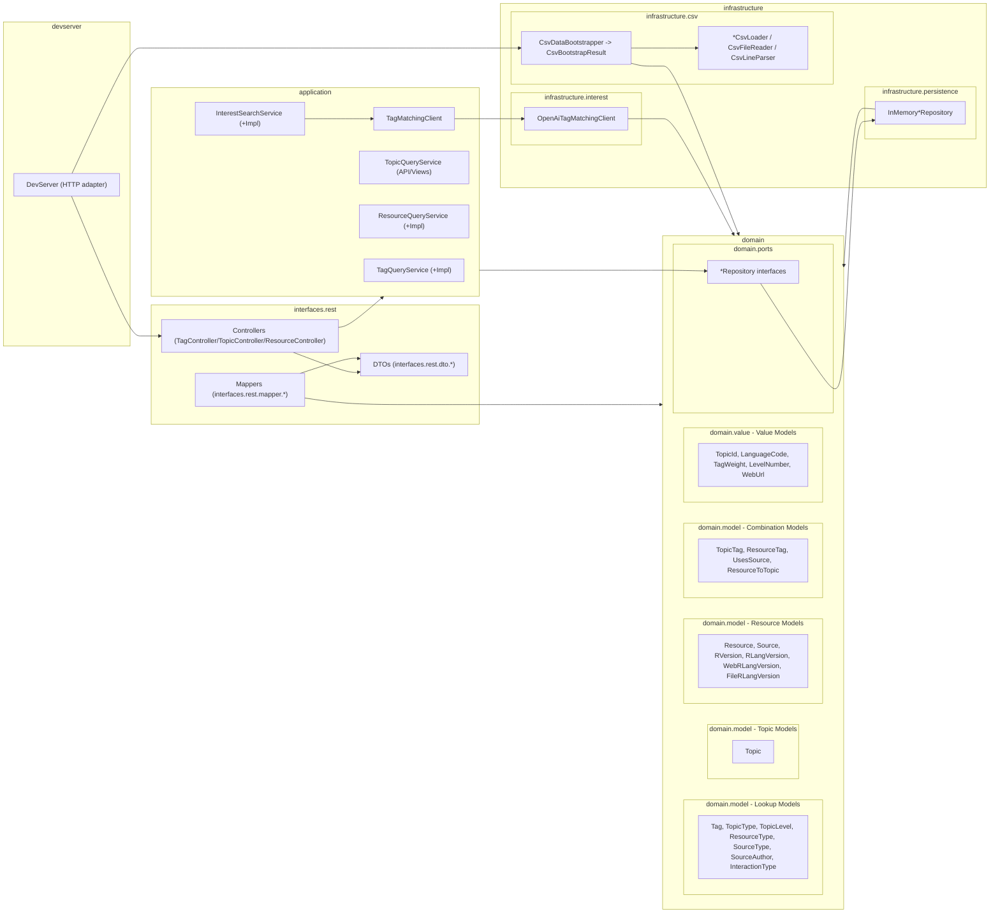
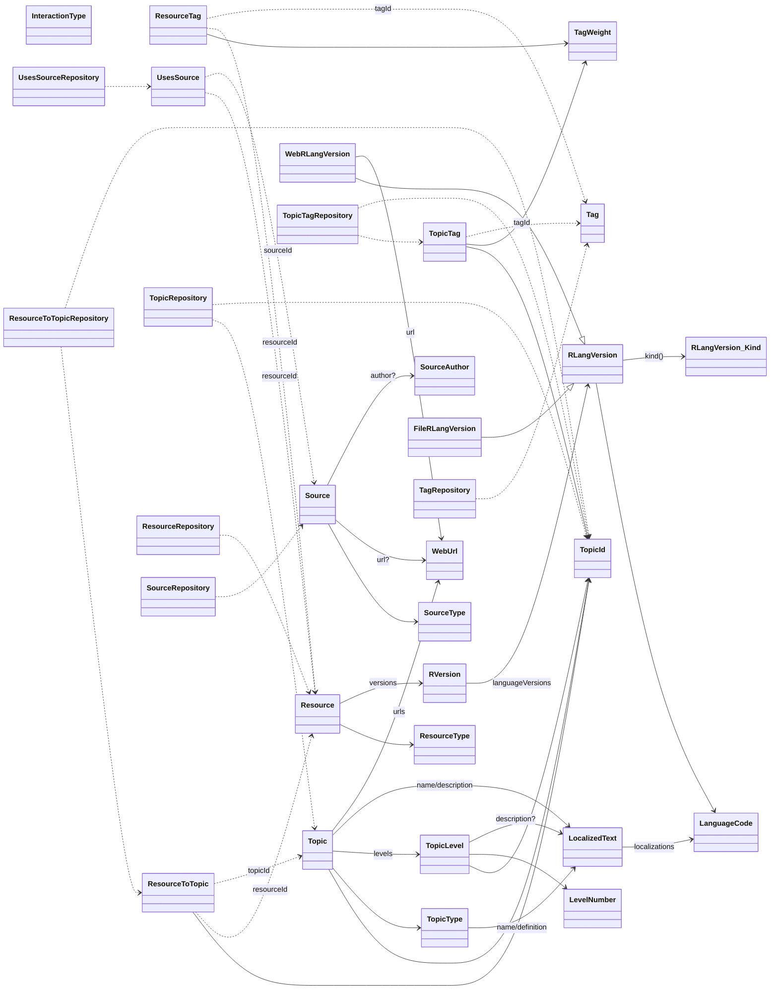

# Projekt-Logbuch

---

## Inhaltsverzeichnis

1. [Idee](#1-idee)
2. [Umsetzung](#2-umsetzung)
   - [M1: Anforderungsanalyse](#m1-anforderungsanalyse)
   - [M2: Entwurf](#m2-entwurf)
   - [M3: Implementierung](#m3-implementierung)
   - [M4: Test](#m4-test)
3. [Learnings](#3-learnings)

---

## 1. Idee

Eine alte Version der Planung findet sich in [./legacy/PLANUNG.md](./legacy/PLANUNG.md).

## 2. Umsetzung

### M1: Anforderungsanalyse

#### Praktische Umsetzung

Siehe [USE_CASES.md](./USE_CASES.md);  
Deckt sich zwar nicht wirklich mit der Theorie der "Anforderungsanalyse", aber in der Eile immerhin besser als nix

#### Theoretische Untermauerung

(Keine Zeit mehr für theoretische Untermauerung :sob:)

### M2: Entwurf

#### Praktische Umsetzung

**Datenfluss (Backend) – vom CSV bis zur API-Antwort**
- **Bootstrapping**: `org.schoolsystem.infrastructure.csv.CsvDataBootstrapper` orchestriert das Laden der CSV-Dateien über diverse `*CsvLoader` und liefert ein `CsvBootstrapResult` mit Domain-Objekten (z.B. `Tag`, `Topic`, `Resource`, `TopicTag`, `ResourceTag`, `Source`, `UsesSource`, …).
- **Persistenz (v1/dev)**: Der Dev-Server verwendet In-Memory-Repositories (`org.schoolsystem.infrastructure.persistence.InMemory*Repository`) als Implementierungen der Domain-Ports (`org.schoolsystem.domain.ports.*Repository`).
- **Use-Case/Service Layer**:
  - `org.schoolsystem.application.tag.TagQueryServiceImpl` liefert alle Tags via `TagRepository`.
  - `org.schoolsystem.application.interest.InterestSearchServiceImpl` verarbeitet die Interessenssuche: lädt alle Tags + Topics + TopicTags, ruft `TagMatchingClient` (z.B. `OpenAiTagMatchingClient`) auf und berechnet daraus Scores pro Topic.
  - `org.schoolsystem.application.resource.ResourceQueryServiceImpl` löst zu einer Ressource die URL über `UsesSourceRepository`/`SourceRepository` auf.
  - `org.schoolsystem.application.topic.TopicQueryService` ist als API-/Use-Case-Interface vorhanden (inkl. Query-/View-Typen), wird im aktuellen DevServer aber (noch) nicht als eigenständige Implementierung verdrahtet.
- **HTTP Adapter (DevServer)**: `org.schoolsystem.devserver.DevServer` ist ein minimaler HTTP-Adapter auf Basis von `com.sun.net.httpserver.HttpServer`.
  - Routing: `GET /api/v1/tags`, `GET /api/v1/topics`, `GET /api/v1/topics/{topicId}`, `POST /api/v1/topics/interest-search`, `GET /health`
  - Request-Parsing: Query-Parameter über `DevServer.QueryParams`, JSON-Body über `DevServer.SimpleJson`
  - Response-Mapping: Domain → DTO (`interfaces.rest.dto.*`) über Mapper (`interfaces.rest.mapper.*`)
  - Serialisierung: DTO → JSON über `DevServer.JsonWriter`
  - CORS: Header werden gesetzt, sodass das Frontend lokal gegen das Backend sprechen kann

**Datenfluss (Frontend) – vom UI zur API und zurück**
- **Routing/View**: `frontend/src/router/index.js` matcht URLs (z.B. `/topics`, `/topics/:topicId`) auf Views (`frontend/src/views/*View.js`).
- **API Calls**: Views rufen `frontend/src/services/*Service.js` auf; diese verwenden `frontend/src/services/apiClient.js`.
- **apiClient**: baut Requests gegen `'/api/v1'`, setzt `Accept-Language` aus `frontend/src/state/languageStore.js`, mappt HTTP-Fehler auf `ApiError` (erwartet dabei Backend-Format `ErrorResponseDto`).
- **Rendering/State**: Views halten lokalen State (Filter, Pagination, selectedTags, …) und rendern Komponenten (`frontend/src/components/**`) aus den geladenen DTO-Strukturen.

**Mermaid-Klassendiagramm (Backend: Java)**

```mermaid
classDiagram
direction LR

%% Legend (by source code):
%% - Interfaces: *QueryService, InterestSearchService, TagMatchingClient, *Repository, *Controller
%% - Enums: InteractionType, TopicQueryService_TopicDetailsResolutionResult_ResolutionStatus, TopicResolutionResponseDto_TopicResolutionStatus

%% =========================
%% devserver (HTTP-Adapter)
%% =========================
class DevServer
%% Mermaid-safe aliases for nested types:
%% - DevServer.BadRequestException -> DevServer_BadRequestException
%% - DevServer.QueryParams        -> DevServer_QueryParams
%% - DevServer.SimpleJson         -> DevServer_SimpleJson
%% - DevServer.JsonWriter         -> DevServer_JsonWriter
class DevServer_BadRequestException
class DevServer_QueryParams
class DevServer_SimpleJson
class DevServer_JsonWriter

DevServer --> DevServer_QueryParams : parses query
DevServer --> DevServer_SimpleJson : parses JSON body
DevServer --> DevServer_JsonWriter : writes JSON

%% =========================
%% application (Use Cases)
%% =========================
class TagQueryService
class TagQueryServiceImpl
class TopicQueryService
class ResourceQueryService
class ResourceQueryServiceImpl
class InterestSearchService
class InterestSearchServiceImpl
class TagMatchingClient

TagQueryServiceImpl ..|> TagQueryService
ResourceQueryServiceImpl ..|> ResourceQueryService
InterestSearchServiceImpl ..|> InterestSearchService

InterestSearchServiceImpl --> TagMatchingClient
InterestSearchServiceImpl --> TopicQueryService : uses TopicWithTags view

%% application nested record types (queries/results/views)
%% Mermaid-safe aliases for nested record/enum types:
%% - TagQueryService.TagListResult -> TagQueryService_TagListResult
%% - ResourceQueryService.ResourceDetailsQuery/View -> ResourceQueryService_ResourceDetailsQuery/View
%% - InterestSearchService.* -> InterestSearchService_*
%% - TopicQueryService.* -> TopicQueryService_* (incl. ResolutionStatus enum)
class TagQueryService_TagListResult
TagQueryService --> TagQueryService_TagListResult
TagQueryService_TagListResult --> Tag

class ResourceQueryService_ResourceDetailsQuery
class ResourceQueryService_ResourceDetailsView
ResourceQueryService --> ResourceQueryService_ResourceDetailsQuery
ResourceQueryService --> ResourceQueryService_ResourceDetailsView
ResourceQueryService_ResourceDetailsView --> Resource
ResourceQueryService_ResourceDetailsQuery --> LanguageCode

class InterestSearchService_InterestSearchQuery
class InterestSearchService_InterestSearchResult
class InterestSearchService_InterestMatchedTagView
class InterestSearchService_InterestTopicScoreView
class InterestSearchService_InterestTopicMatchedTagView
InterestSearchService --> InterestSearchService_InterestSearchQuery
InterestSearchService --> InterestSearchService_InterestSearchResult
InterestSearchService_InterestSearchResult --> InterestSearchService_InterestMatchedTagView
InterestSearchService_InterestSearchResult --> InterestSearchService_InterestTopicScoreView
InterestSearchService_InterestMatchedTagView --> Tag
InterestSearchService_InterestTopicScoreView --> TopicQueryService_TopicWithTags
InterestSearchService_InterestTopicMatchedTagView --> Tag

class TopicQueryService_TopicListQuery
class TopicQueryService_TopicListResult
class TopicQueryService_TopicWithTags
class TopicQueryService_TopicDetailsQuery
class TopicQueryService_TopicDetailsResolutionResult
class TopicQueryService_TopicDetailsResolutionResult_ResolutionStatus
class TopicQueryService_TopicDetailsView
class TopicQueryService_TopicResourceScoreView
class TopicQueryService_ResourceScoreContributionView
class TopicQueryService_SimilarTopicView

TopicQueryService --> TopicQueryService_TopicListQuery
TopicQueryService --> TopicQueryService_TopicListResult
TopicQueryService --> TopicQueryService_TopicDetailsQuery
TopicQueryService --> TopicQueryService_TopicDetailsResolutionResult
TopicQueryService_TopicDetailsResolutionResult --> TopicQueryService_TopicDetailsResolutionResult_ResolutionStatus
TopicQueryService_TopicDetailsResolutionResult --> Topic
TopicQueryService_TopicDetailsResolutionResult --> TopicQueryService_TopicDetailsView
TopicQueryService_TopicDetailsView --> Topic
TopicQueryService_TopicDetailsView --> Tag
TopicQueryService_TopicDetailsView --> TopicQueryService_TopicResourceScoreView
TopicQueryService_TopicDetailsView --> TopicQueryService_SimilarTopicView
TopicQueryService_TopicResourceScoreView --> Resource
TopicQueryService_TopicResourceScoreView --> TopicQueryService_ResourceScoreContributionView
TopicQueryService_SimilarTopicView --> TopicId
TopicQueryService_SimilarTopicView --> Topic
TopicQueryService_TopicListResult --> TopicQueryService_TopicWithTags
TopicQueryService_TopicWithTags --> Topic
TopicQueryService_TopicWithTags --> Tag
TopicQueryService_TopicListQuery --> LanguageCode
TopicQueryService_TopicDetailsQuery --> LanguageCode

%% =========================
%% domain (Models + Values)
%% =========================
class Tag
class Topic
class Resource
class TopicTag
class ResourceTag
class ResourceToTopic
class Source
class SourceAuthor
class UsesSource

class LocalizedText
class TopicType
class TopicLevel
class ResourceType
class SourceType
class InteractionType
class RVersion
class RLangVersion
class WebRLangVersion
class FileRLangVersion

class TopicId
class LanguageCode
class TagWeight
class LevelNumber
class WebUrl

Topic --> TopicId
Topic --> TopicType
Topic --> LocalizedText : name/description
Topic --> WebUrl : urls
Topic --> TopicLevel : levels
TopicType --> LocalizedText : name/definition
LocalizedText --> LanguageCode : localizations

TopicTag --> TopicId
TopicTag --> TagWeight
ResourceTag --> TagWeight
UsesSource --> Source
UsesSource --> Resource
Source --> SourceType
Source --> WebUrl
Source --> SourceAuthor
Resource --> ResourceType
Resource --> RVersion : versions
RVersion --> RLangVersion
RLangVersion <|-- WebRLangVersion
RLangVersion <|-- FileRLangVersion

%% =========================
%% domain ports (Repositories)
%% =========================
class TagRepository
class TopicRepository
class TopicTagRepository
class ResourceRepository
class ResourceToTopicRepository
class SourceRepository
class UsesSourceRepository

TagRepository --> Tag
TopicRepository --> Topic
TopicTagRepository --> TopicTag
ResourceRepository --> Resource
ResourceToTopicRepository --> ResourceToTopic
SourceRepository --> Source
UsesSourceRepository --> UsesSource

%% =========================
%% infrastructure.persistence (In-Memory adapters)
%% =========================
class InMemoryTagRepository
class InMemoryTopicRepository
class InMemoryTopicTagRepository
class InMemoryResourceRepository
class InMemoryResourceToTopicRepository
class InMemorySourceRepository
class InMemoryUsesSourceRepository

InMemoryTagRepository ..|> TagRepository
InMemoryTopicRepository ..|> TopicRepository
InMemoryTopicTagRepository ..|> TopicTagRepository
InMemoryResourceRepository ..|> ResourceRepository
InMemoryResourceToTopicRepository ..|> ResourceToTopicRepository
InMemorySourceRepository ..|> SourceRepository
InMemoryUsesSourceRepository ..|> UsesSourceRepository

%% =========================
%% infrastructure.csv (Bootstrap + Loaders)
%% =========================
class CsvDataBootstrapper
class CsvBootstrapResult
class CsvFileReader
class CsvLineParser
class SourceImportResult

class TagCsvLoader
class TopicCsvLoader
class TopicTagCsvLoader
class TopicTypeCsvLoader
class TopicLevelCsvLoader
class ResourceTagCsvLoader
class ResourceTypeCsvLoader
class SourceCsvLoader
class SourceTypeCsvLoader
class SourceAuthorCsvLoader

CsvDataBootstrapper --> CsvFileReader
CsvFileReader --> CsvLineParser

CsvDataBootstrapper --> TagCsvLoader
CsvDataBootstrapper --> TopicCsvLoader
CsvDataBootstrapper --> TopicLevelCsvLoader
CsvDataBootstrapper --> TopicTagCsvLoader
CsvDataBootstrapper --> SourceAuthorCsvLoader
CsvDataBootstrapper --> SourceCsvLoader
CsvDataBootstrapper --> ResourceTagCsvLoader
CsvDataBootstrapper --> ResourceTypeCsvLoader
CsvDataBootstrapper --> TopicTypeCsvLoader
CsvDataBootstrapper --> SourceTypeCsvLoader

TagCsvLoader --> Tag
TopicCsvLoader --> Topic
TopicLevelCsvLoader --> TopicLevel
TopicTypeCsvLoader --> TopicType
TopicTagCsvLoader --> TopicTag
ResourceTypeCsvLoader --> ResourceType
ResourceTagCsvLoader --> ResourceTag
SourceTypeCsvLoader --> SourceType
SourceAuthorCsvLoader --> SourceAuthor
SourceCsvLoader --> SourceImportResult
SourceImportResult --> Source
SourceImportResult --> Resource
SourceImportResult --> RVersion
SourceImportResult --> RLangVersion
SourceImportResult --> UsesSource

CsvDataBootstrapper --> CsvBootstrapResult
CsvBootstrapResult --> Tag
CsvBootstrapResult --> Topic
CsvBootstrapResult --> Resource
CsvBootstrapResult --> TopicTag
CsvBootstrapResult --> ResourceTag
CsvBootstrapResult --> TopicLevel
CsvBootstrapResult --> TopicType
CsvBootstrapResult --> ResourceType
CsvBootstrapResult --> SourceType
CsvBootstrapResult --> SourceAuthor
CsvBootstrapResult --> Source
CsvBootstrapResult --> UsesSource

%% =========================
%% infrastructure.interest (AI adapter)
%% =========================
class OpenAiTagMatchingClient
OpenAiTagMatchingClient ..|> TagMatchingClient
OpenAiTagMatchingClient --> Tag
OpenAiTagMatchingClient --> LanguageCode

%% =========================
%% interfaces.rest (API contract + DTOs + Mappers)
%% =========================
class TagController
class TopicController
class ResourceController

class TagDto
class TagListResponseDto
class TopicSummaryDto
class TopicListResponseDto
class TopicDetailDto
class TopicResolutionResponseDto
class InterestSearchRequestDto
class InterestSearchResponseDto
class ResourceSummaryDto
class ErrorResponseDto

class TagDtoMapper
class TopicDtoMapper
class ResourceDtoMapper
class LocalizedTextMapper

%% dto nested record/enum types
%% Mermaid-safe aliases for nested DTOs/enums + mapper helper records:
%% - TopicDetailDto.* -> TopicDetailDto_*
%% - TopicResolutionResponseDto.* -> TopicResolutionResponseDto_*
%% - InterestSearchResponseDto.* -> InterestSearchResponseDto_*
%% - TopicDtoMapper.* -> TopicDtoMapper_*
class TopicDetailDto_TopicTagDto
class TopicDetailDto_TopicResourceScoreDto
class TopicDetailDto_TopicResourceMatchedTagDto
class TopicDetailDto_SimilarTopicDto
TopicDetailDto --> TopicDetailDto_TopicTagDto
TopicDetailDto --> TopicDetailDto_TopicResourceScoreDto
TopicDetailDto_TopicResourceScoreDto --> TopicDetailDto_TopicResourceMatchedTagDto
TopicDetailDto --> TopicDetailDto_SimilarTopicDto

class TopicResolutionResponseDto_TopicResolutionStatus
class TopicResolutionResponseDto_TopicResolutionCandidateDto
TopicResolutionResponseDto --> TopicResolutionResponseDto_TopicResolutionStatus
TopicResolutionResponseDto --> TopicResolutionResponseDto_TopicResolutionCandidateDto

class InterestSearchResponseDto_InterestMatchedTagDto
class InterestSearchResponseDto_InterestTopicScoreDto
class InterestSearchResponseDto_InterestTopicMatchedTagDto
InterestSearchResponseDto --> InterestSearchResponseDto_InterestMatchedTagDto
InterestSearchResponseDto --> InterestSearchResponseDto_InterestTopicScoreDto
InterestSearchResponseDto_InterestTopicScoreDto --> InterestSearchResponseDto_InterestTopicMatchedTagDto

%% mapper helper record types
class TopicDtoMapper_ScoredResource
class TopicDtoMapper_MatchedTag
class TopicDtoMapper_SimilarTopicInfo
TopicDtoMapper_ScoredResource --> Resource
TopicDtoMapper_ScoredResource --> TopicDtoMapper_MatchedTag
TopicDtoMapper --> TopicDtoMapper_ScoredResource
TopicDtoMapper --> TopicDtoMapper_SimilarTopicInfo

TagController --> TagListResponseDto
TopicController --> TopicListResponseDto
TopicController --> TopicResolutionResponseDto
TopicController --> InterestSearchRequestDto
TopicController --> InterestSearchResponseDto
ResourceController --> ResourceSummaryDto

TagDtoMapper --> Tag
TagDtoMapper --> TagDto

LocalizedTextMapper --> LocalizedText
ResourceDtoMapper --> Resource
ResourceDtoMapper --> ResourceSummaryDto
ResourceDtoMapper --> LocalizedTextMapper

TopicDtoMapper --> Topic
TopicDtoMapper --> Tag
TopicDtoMapper --> TopicSummaryDto
TopicDtoMapper --> TopicDetailDto
TopicDtoMapper --> ResourceDtoMapper
TopicDtoMapper --> LocalizedTextMapper

%% =========================
%% Wiring (current dev setup)
%% =========================
DevServer --> CsvDataBootstrapper
DevServer --> CsvBootstrapResult
DevServer --> InMemoryTagRepository
DevServer --> InMemoryTopicRepository
DevServer --> InMemoryTopicTagRepository
DevServer --> TagQueryService
DevServer --> TagQueryServiceImpl
DevServer --> InterestSearchService
DevServer --> InterestSearchServiceImpl
DevServer --> OpenAiTagMatchingClient
DevServer --> TagDtoMapper
DevServer --> TopicDtoMapper
DevServer --> LocalizedTextMapper
DevServer --> ErrorResponseDto
DevServer --> TagListResponseDto
DevServer --> TopicListResponseDto
DevServer --> TopicResolutionResponseDto
DevServer --> InterestSearchRequestDto
DevServer --> InterestSearchResponseDto
```

**Mermaid-Klassendiagramm (Backend: Java), nach funktionalen Gruppen**
Short what every functional Group does (from bottom to top):
- **domain.value**: Defines small **validated** value objects (e.g. `TopicId`, `LanguageCode`) used across the domain.
- **domain.model - Lookup Models**: Represents shared **reference data** such as types/authors and tags that other models point to.
- **domain.model - Topic Models**: Represents topics including names/descriptions, levels, and links (the 'learning structure').
- **domain.model - Resource Models**: Represents resources/sources and their (language) versions, including resolvable URLs.
- **domain.model - Combination Models**: Represents many-to-many 'end-to-end' **relations** like Topic<->Tag, Resource<->Tag, Resource<->Topic, and Resource<->Source.
- **domain.ports**: Declares repository interfaces so **use cases can access domain data** without depending on storage/IO tech.
- **infrastructure.csv**: Loads raw **CSV** files and maps them into domain objects for bootstrapping.
- **infrastructure.persistence**: Provides in-memory repository implementations of the domain ports for dev/runtime wiring.
- **infrastructure.interest**: Implements the `TagMatchingClient` adapter (OpenAI) used by the interest search use case.
- **application**: Orchestrates the **use cases** and **scoring logic** by combining domain objects via ports and returning stable results.
- **interfaces.rest**: Defines the **API contract** (DTOs/controllers) and maps application/domain results to HTTP responses.
- **devserver**: **Wires** everything together for local development and **exposes the HTTP endpoints**.

**Mermaid-Klassendiagramm (Backend: Java), domain-only**

**Limitierungen**:
- Im momentanen Scope **KEINE Logik-Funktionalitäten**
  - Geplant: Login mit Speicherung von Resource-Interaktionen
- Im momentanen Scope **KEINE CRUD-Funktionalitäten**, da Topics, Ressourcen & co. momentan noch in Stein gemeisselt sind
  - Geplant: Update von Topic- und Ressourcen-Einträgen, sowie Tags & co.

#### Theoretische Untermauerung

### M3: Implementierung

#### Praktische Umsetzung

Irgendwas funktioniert noch nicht aaaaah  
ABGABE

#### Theoretische Untermauerung

### M4: Test

#### Praktische Umsetzung

Unit-Tests bis zu einem gewissen Zeitpunkt, danach 

#### Theoretische Untermauerung

## 3. Learnings

Ein full-on Java-Projekt ist WEITAUS komplexer und vielschichtiger als ich erwartet hätte;  
Zudem muss ich künftig unbedingt schauen - und dies bei JEDEM Projekt & Auftrag, dass ich es zu gewährleisten schaffe, dass ich Umstände schaffe, welche mich immer nur exakt ein einziges Projekt/Auftrag als objektiv am wichtigsten wahrnehmen lassen; Das mit diesem Projekt hier war wieder eine Katastrophe, da ich ständig (bis Mittwoch der letzten Woche vor Abgabe) mich ständig ablenken und in die Prokrastination reiten liess, weil die Existenz eines Betriebsprojektes und die Zusammenstellung von Bewerbungsunterlagen für das Praktikum ständig von diesem Projekt hier haben ablenken lassen;

Sie wollen noch was Fachliches hören? Dat reiche ich vielleicht bis zum Vortrag noch nach, aber jetzt war schon Mitternacht und ich hab' noch nicht abgegeben und ich hasse mein Hirn deswegen - UND WARUM REQUEST FAILED AAAH
